## 操作流程

1. **项目初始化**
   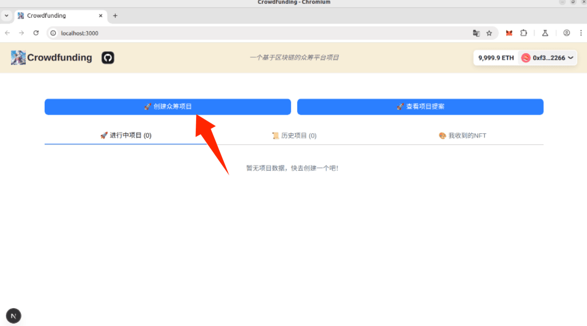
   > 在正确启动测试链，链上监听器，还有前端并通过 metamask 连接钱包后，点击"创建众筹项目"按钮即可创建项目

2. **创建众筹项目**
   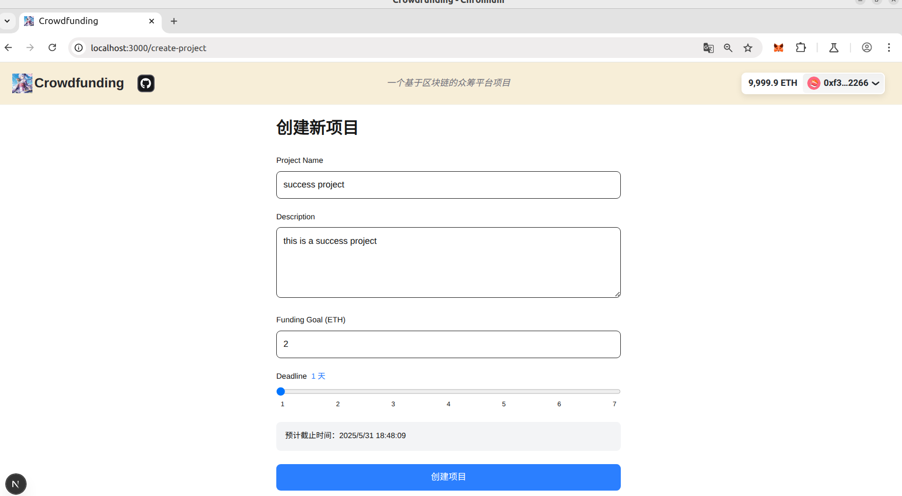
   - 众筹项目名称
   - 众筹项目描述
   - 目标金额（ETH）
   - 截止日期
   > 点击"创建项目"按钮，钱包弹出交易之后确认交易即可

3. **项目创建成功**
   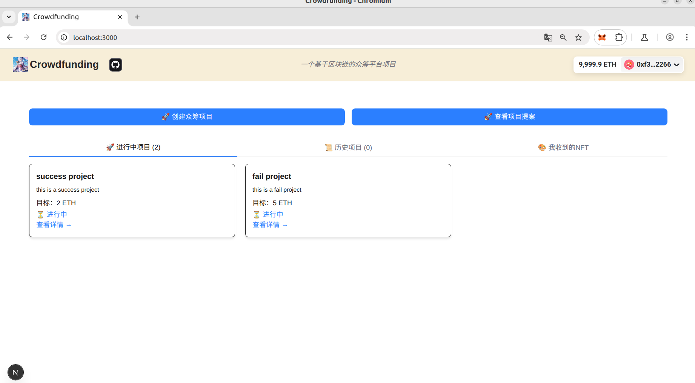
   > 创建成功，正在进行中的项目列表会出现刚创建的项目，在这里我创建了两个项目用于测试，一个成功一个失败。

4. **项目详情**
   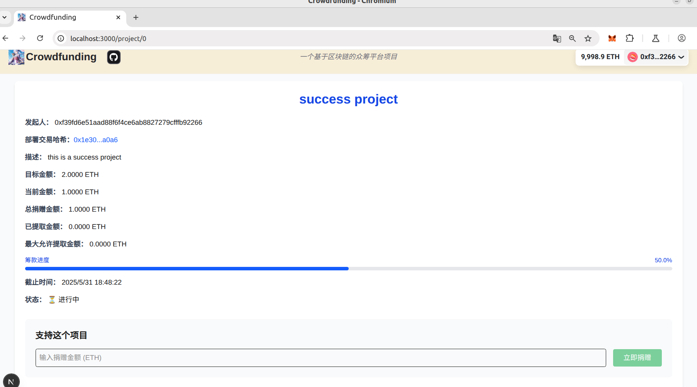 
   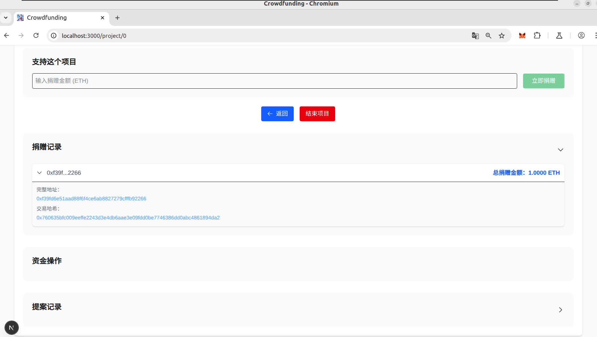
    > 点击对应项目的查看详情按钮，进入项目详情页面，这里有该项目的详细信息，包括项目的截止日期和状态，以及捐赠的按钮，输入捐赠金额之后点击立即捐赠即可向项目捐赠金额，刷新页面之后即可看到筹款进度更新。下面也有捐赠记录的的按钮，点击之后可以查看捐赠的详细信息。包括交易的哈希以及某个地址一共向该项目捐赠了多少金额。因为有人可能反复向同一个项目捐赠，所以显示的是总捐赠金额。

5. **完成项目**
   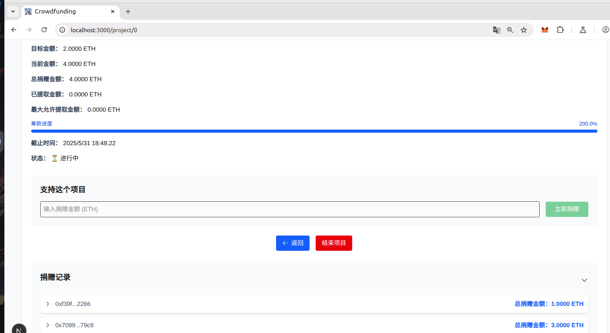
   > 使用jsonrpc的命令修改本地区块链的时间之后同时也需要修改前端判定项目结束的时间，否则结束项目的按钮点击之后无法生效(因为按逻辑是现实的时间，但是测试的时候不可能等几天所以修改时间进行测试)。在用另一个账户捐赠足够的金额之后，点击"完成项目"按钮，钱包弹出交易之后确认交易即可完成项目。

6. **项目资金的提取**
    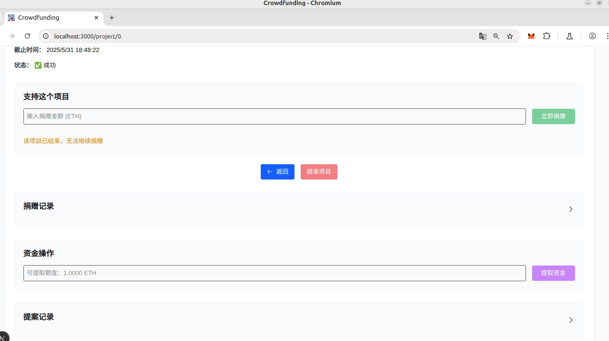
    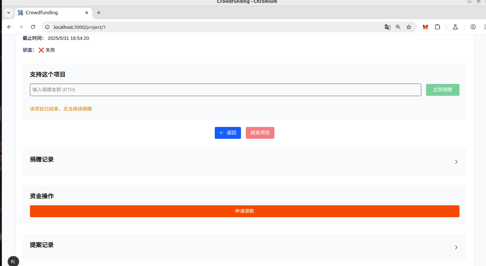
    > 项目完成之后，如果众筹项目成功，项目的发起者最多可以提取众筹总金额25%的资金，且只有项目发起者进入项目详情页面的时候才能看到提取资金的按钮。如果众筹失败，捐赠者可以点击申请退款，取回自己捐赠的资金。

7. **创建项目提案**
    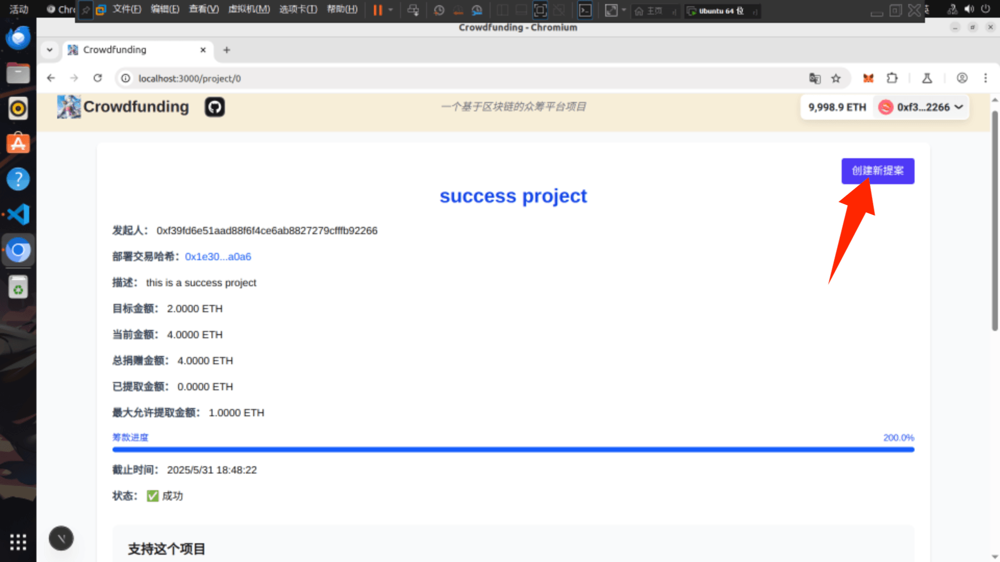
    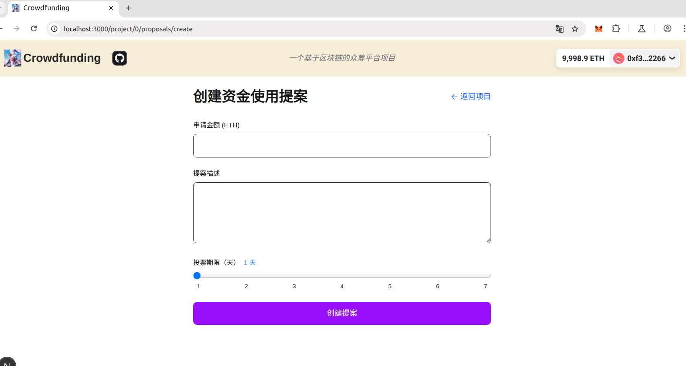
   > 只有项目创始人可以看到创建提案的按钮，且在上个提案未执行之前不可以创建新的提案。点击"创建新提案"按钮，弹出创建项目提案的界面，输入提案申请的金额和申请的理由，最好附上之前的资金用来做了什么的证明。最后选择截至的日期，点击"创建提案"按钮，钱包弹出交易之后确认交易即可创建提案。

8. **查看提案详情入口**
     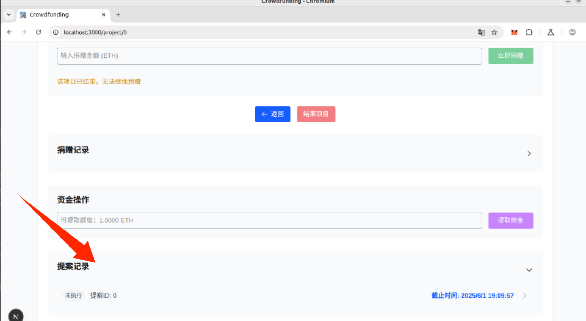
     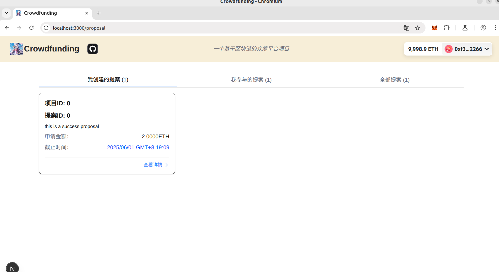
   > 可以通过点击主页右上方的"查看项目提案"按钮，进入提案详情页面，这里可以看到项目和提案的id，申请理由，提案的截至日期。也可以在对应的项目最下方找到提案记录，点击对应的记录即可跳转到相应的界面。

9. **查看提案详情**
     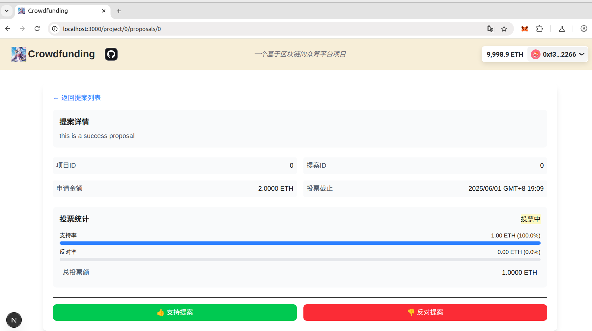
      > 提案详情页面，这里可以看到提案的申请理由和金额，提案的截止日期，提案的投票统计，只有向该项目捐赠金额的人才有投票权，且同一提案一个地址只能进行一次投票。只有截至日期到了才能结束项目，支持的金额占总投票金额的60%以上，才能通过。

10. **结束投票**
   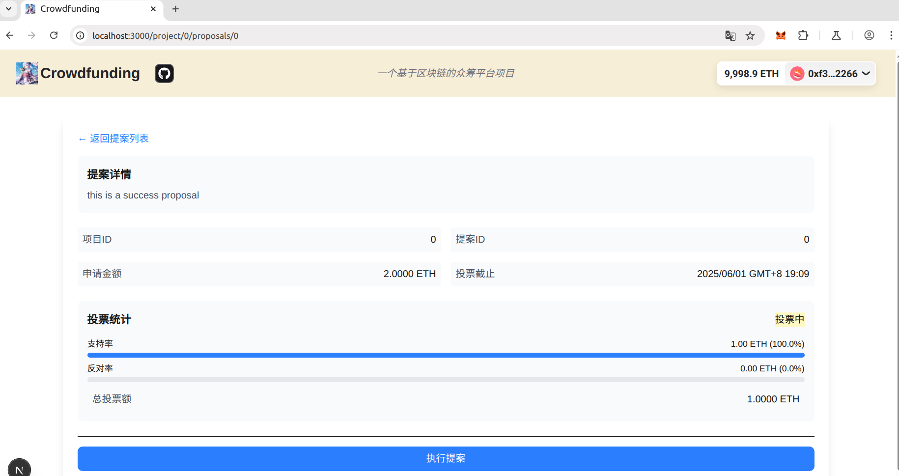
   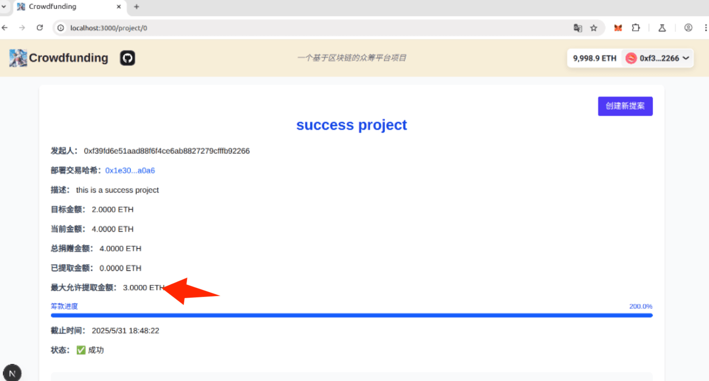
   > 这里也需要进行区块链时间的修改和前端时间判定的修改。当时间达到截止日期时，任何人都可以结束该提案，如果成功，则项目的最大允许提取金额上限就会增加。

11. **提取项目资金**
   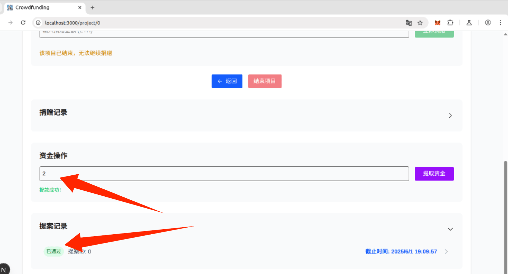
   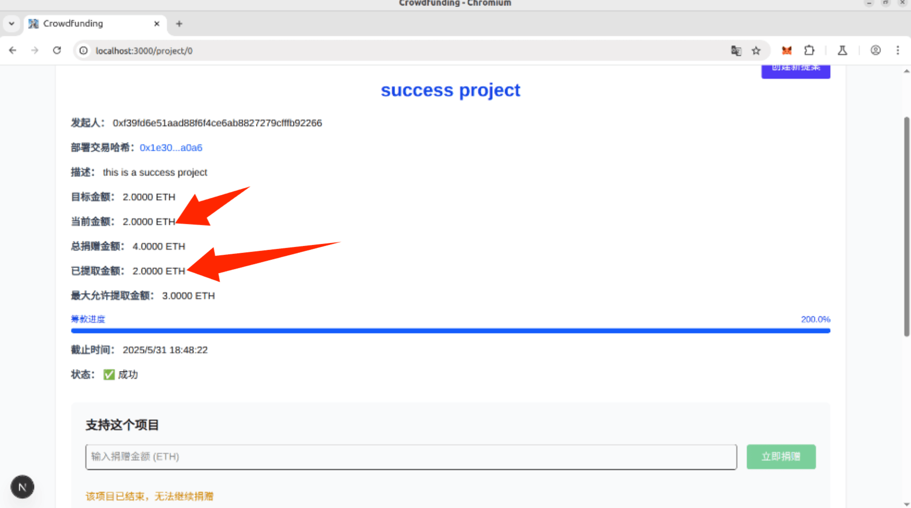